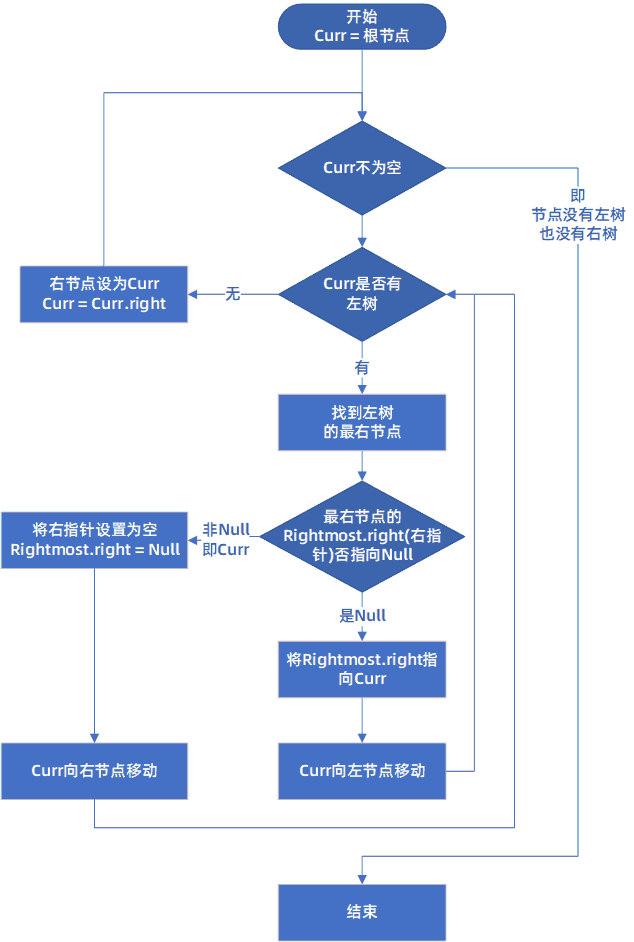

# 二叉树
未完待续 | LastUpdated 2022年5月4日
## 知识点
* 遍历：前、中、后序的递归、非递归写法、层次遍历

## 相关题
* [94. 二叉树的中序遍历](../src/0099/94.ts)

## 遍历顺序
* 遍历顺序就是输出顺序不同
* 前序遍历：`root -> left -> right`
* 中序遍历：`left -> root -> right`
* 后序遍历：`left -> right -> root`

## 遍历算法
有如下二叉树：

```
       1
      / \
    2      3
     \    / \
      5  6   7
```

### 最简单的递归遍历
```js
interface IBinaryTree{
  data: number,
  left?: IBinaryTree,
  right?: IBinaryTree,
}
// 就看对data的访问写在什么地方
Traversal(root:IBinaryTree) {
  if (!root) return
  // result.push(root.data) // 前序遍历 [1, 2, 5, 3, 6, 7]
  Traversal(root.left)
  // result.push(root.data) // 中序遍历 [2, 5, 1, 6, 3, 7]
  Traversal(root.right)
  // result.push(root.data) // 后序遍历 [5, 2, 6, 7, 3, 1]
}
```

## 迭代遍历
用栈暂时来保存节点（不是保存节点值，而是整个节点）
### 迭代法中序遍历

从当前节点开始一直向下访问左节点，并逐个push到栈里（不要取值，只是push到栈里）

直到最后一个左节点入栈后，将栈顶节点出栈（第一次执行时，栈顶节点就是最后一个左节点），取值打印

然后将这个刚出栈的右节点设为当前节点，继续遍历。

实现代码：[94. 二叉树的中序遍历](../src/0099/94.ts)


## Morris遍历



实现代码：[94. 二叉树的中序遍历](../src/0099/94.ts)

## 参考资料
* https://www.bilibili.com/video/BV1tX4y1G715?p=5
* https://zhuanlan.zhihu.com/p/101321696
* https://www.codingninjas.com/codestudio/library/morris-traversal-for-inorder